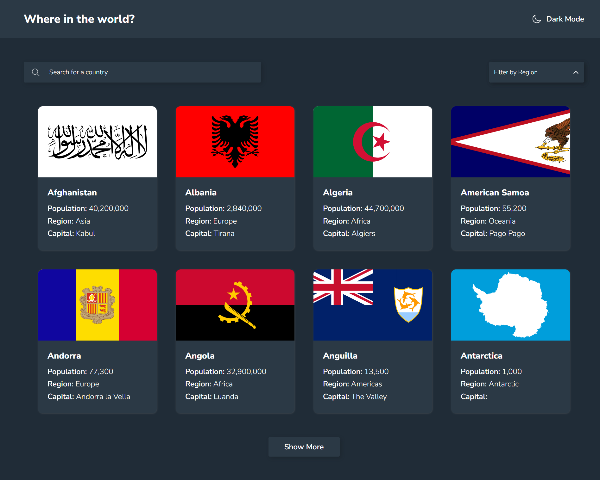

# Frontend Mentor - REST Countries API with color theme switcher solution

This is a solution to the [REST Countries API with color theme switcher challenge on Frontend Mentor](https://www.frontendmentor.io/challenges/rest-countries-api-with-color-theme-switcher-5cacc469fec04111f7b848ca). Frontend Mentor challenges help you improve your coding skills by building realistic projects. 

## Table of contents

- [Overview](#overview)
  - [The challenge](#the-challenge)
  - [Screenshot](#screenshot)
  - [Links](#links)
- [My process](#my-process)
  - [Built with](#built-with)
  - [Useful resources](#useful-resources)
- [Author](#author)

## Overview

### The challenge

Users should be able to:

- See all countries from the API on the homepage
- Search for a country using an `input` field
- Filter countries by region
- Click through to the border countries on the detail page
- Toggle the color scheme between light and dark mode

### Screenshot

    <h5>Desktop: </h5>
    
    

    <h5>Mobile: </h5>
    
    

### Links

- Solution URL: [https://www.frontendmentor.io/solutions/responsive-country-info-app-by-using-react-react-router-sass-axios-_fixosYiyl](https://www.frontendmentor.io/solutions/responsive-country-info-app-by-using-react-react-router-sass-axios-_fixosYiyl)
- Live Site URL: [https://nicoleyry-countries-info-app.netlify.app/](https://nicoleyry-countries-info-app.netlify.app/)

## My process

### Built with

- Semantic HTML5 markup
- CSS custom properties
- Flexbox
- CSS Grid
- Mobile-first workflow
- [React](https://reactjs.org/) - JS library
- [React Router](https://reactrouter.com/)
- [SASS](https://sass-lang.com/) - For styles
- [Axios](https://axios-http.com/)

### Useful resources

- [How to create a React Dropdown](https://www.robinwieruch.de/react-dropdown/)
- [Mapping Data to React Components](https://codesandbox.io/s/mapping-data-to-components-y1nr7)
- [How to sort an Array of Objects in React](https://bobbyhadz.com/blog/react-sort-array-of-objects)
- [How to Go back to the previous Page with React Router](https://bobbyhadz.com/blog/react-router-go-back-to-previous-page)
- [How to Deploy a React Router App to Netlify and Fix the "Page Not Found" Error](https://www.freecodecamp.org/news/how-to-deploy-a-routed-react-app-to-netlify/)

## Author

- Website - [Nicole Yang](https://www.nicoleyry.com/)
- Frontend Mentor - [@nicoleyry](https://www.frontendmentor.io/profile/nicoleyry)
- Twitter - [@nicoleyry](https://twitter.com/nicoleyry)
